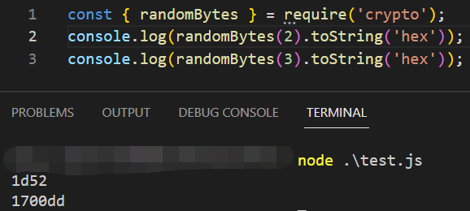
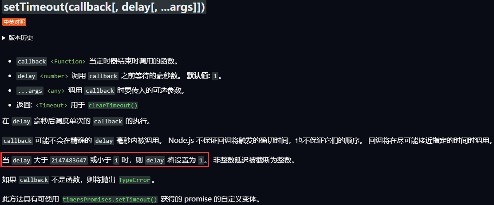
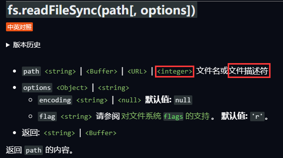
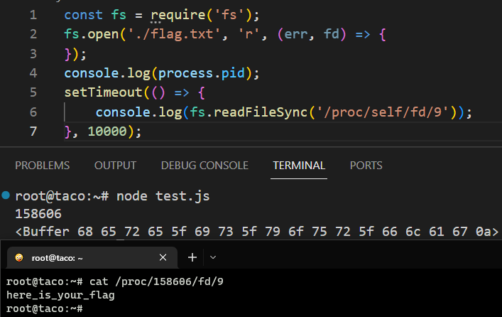

题目地址：[NSSCTF - prize_p2 (ctfer.vip)](https://www.ctfer.vip/problem/225)

```js
const { randomBytes } = require('crypto');
const express = require('express');
const fs = require('fs');
const fp = '/app/src/flag.txt';
const app = express();
const flag = Buffer(255);
const a = fs.open(fp, 'r', (err, fd) => {
    fs.read(fd, flag, 0, 44, 0, () => {
        fs.rm(fp, () => {});
    });
});

app.get('/', function (req, res) {
    res.set('Content-Type', 'text/javascript;charset=utf-8');
    res.send(fs.readFileSync(__filename));
});

app.get('/hint', function (req, res) {
    res.send(flag.toString().slice(0, randomBytes(1)[0]%32));
})

// 随机数预测或者一天之后
app.get('/getflag', function (req, res) {
    res.set('Content-Type', 'text/javascript;charset=utf-8');
    try {
        let a = req.query.a;
        if (a === randomBytes(3).toString()) {
            res.send(fs.readFileSync(req.query.b));
        } else {
            const t = setTimeout(() => {
                res.send(fs.readFileSync(req.query.b));
            }, parseInt(req.query.c)?Math.max(86400*1000, parseInt(req.query.c)):86400*1000);
        }
    } catch {
        res.send('?');
    }
})

app.listen(80, '0.0.0.0', () => {
    console.log('Start listening')
});
```

`randomBytes(x)` x为生成随机数的字节数



`/hint`只能拿到flag的前半部分，貌似没啥用

`/getflag`要么得猜对一个3字节的随机数，要么得等`86400 = 24 * 60 * 60`秒，也就是一天

查看setTimeout的官方文档，发现当delay＞ 2147483647 就会被设为1，就相当于立即执行了。



。。。写这么大的数就是吓唬人的

但是代码里面将flag.txt读入Buffer之后就把原文件删掉了

细心点可以发现这里并未执行`fs.close(fd)`，也就是文件描述符还在

> Linux 系统中，把一切都看做是文件，当进程打开现有文件或创建新文件时，内核向进程返回一个文件描述符，文件描述符就是内核为了高效管理已被打开的文件所创建的索引，用来指向被打开的文件，所有执行I/O操作的系统调用都会通过文件描述符。



`fs.readFileSync`是可以传入文件描述符的！

`/proc/self/fd` 这个目录里包含了进程打开文件的情况，里面有一系列`/proc/self/fd/id`文件，id就是进程记录的打开文件的文件描述符的序号。id可爆破猜测获得。

`http://1.14.71.254:28491/getflag?b=/proc/self/fd/x&c=2147483648`

遍历x即可（x从3开始，这里试到18成功）



