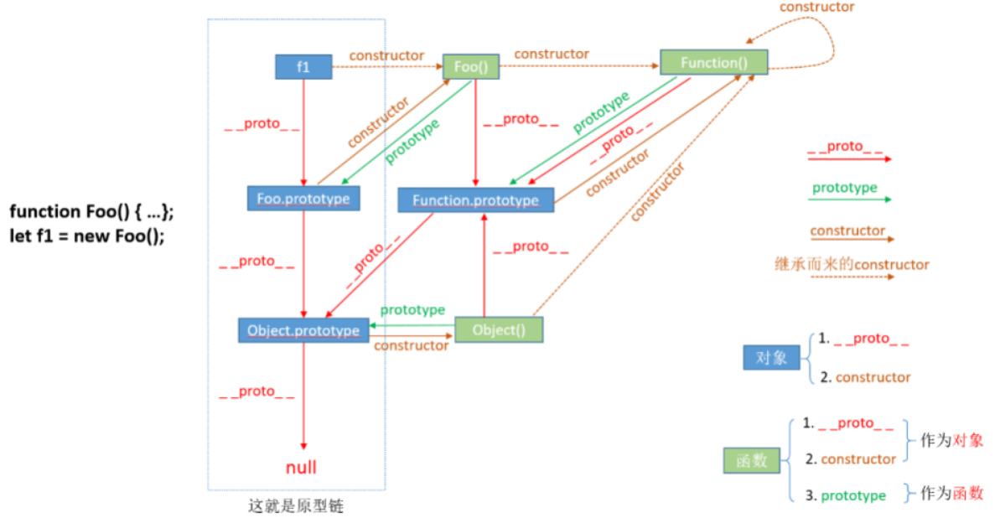
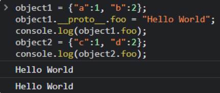

# 0x01 前言

不同于基于类的语言(Java、C++)，js作为动态语言，是基于原型的。

在JavaScript中，万物皆对象。每个实例对象（object）都有一个私有属性（`__proto__`）指向它的构造函数（**constructor**）的原型对象（**prototype**）。该原型对象也有一个自己的原型对象（`__proto__`），层层向上直到一个对象的原型对象为`null`。`null`没有原型，作为原型链中的最后一个环节。

# 0x02 基于原型链的继承

### 继承属性

当试图访问一个对象的属性时，它不仅在该对象上搜索，还会搜索该对象的原型，以及该对象的原型的原型，依次层层向上搜索，直到找到匹配名字的属性或到达原型链的末尾（`null`）

```javascript
let f = function () {
   this.a = 1;
   this.b = 2;
}

let o = new f(); // {a: 1, b: 2}

// 在 f 函数的原型上定义属性
f.prototype.b = 3;
f.prototype.c = 4;

// 不要在 f 函数的原型上直接定义 
// f.prototype = {b:3,c:4};这样会直接打破原型链

// a是o自身的属性
console.log(o.a); // 1

// b是o自身的属性，它的原型上也有'b'属性，但不会被访问到，称为属性遮蔽property shadowing
console.log(o.b); // 2

// c不是o自身的属性，去它的原型上找
console.log(o.c); // 4

// d不是o自身的属性，且在其原型链上也找不到
console.log(o.d); // undefined

// {a:1, b:2} ---> {b:3, c:4} ---> Object.prototype---> null
```

### 继承方法

JS中没有其他基于类的语言所谓的“方法”。在JS中任何函数中可以添加到对象上作为对象的属性，函数的继承与其他属性的继承相同，包括上面的属性遮蔽（相当于其他语言的方法重写。）被继承的函数被调用时，this指向的是当前继承的对象。

```javascript
var o = {
  a: 2,
  m: function(){
    return this.a + 1;
  }
};

console.log(o.m()); // 3
// 当调用 o.m 时，'this' 指向了 o.

var p = Object.create(o);
// p 是一个继承自 o 的对象

p.a = 4; // 创建 p 的自身属性 'a'
console.log(p.m()); // 5
// 调用 p.m 时，'this' 指向了 p
// 又因为 p 继承了 o 的 m 函数
// 所以，此时的 'this.a' 即 p.a，就是 p 的自身属性 'a'
```

# 0x03 原型对象

在JS中，函数是允许拥有属性的，所有函数会有一个特别的属性——`prototype`

```javascript
function doSomething(){}
console.log( doSomething.prototype );
// 和声明函数的方式无关，
// JavaScript 中的函数永远有一个默认原型属性。
var doSomething = function(){};
console.log( doSomething.prototype );

{
    constructor: ƒ doSomething(),
    __proto__: {
        constructor: ƒ Object(),
        hasOwnProperty: ƒ hasOwnProperty(),
        isPrototypeOf: ƒ isPrototypeOf(),
        propertyIsEnumerable: ƒ propertyIsEnumerable(),
        toLocaleString: ƒ toLocaleString(),
        toString: ƒ toString(),
        valueOf: ƒ valueOf()
    }
}
```

试着给函数的原型对象添加新属性

```javascript
function doSomething(){}
doSomething.prototype.foo = "bar";
console.log( doSomething.prototype );

{
    foo: "bar",
    constructor: ƒ doSomething(),
    __proto__: {
        constructor: ƒ Object(),
        hasOwnProperty: ƒ hasOwnProperty(),
        isPrototypeOf: ƒ isPrototypeOf(),
        propertyIsEnumerable: ƒ propertyIsEnumerable(),
        toLocaleString: ƒ toLocaleString(),
        toString: ƒ toString(),
        valueOf: ƒ valueOf()
    }
}
```

试着给函数的实例对象添加新属性

```javascript
function doSomething(){}
doSomething.prototype.foo = "bar"; // add a property onto the prototype
var doSomeInstancing = new doSomething();
doSomeInstancing.prop = "some value"; // add a property onto the object
console.log( doSomeInstancing );

{
    prop: "some value",
    __proto__: {
        foo: "bar",
        constructor: ƒ doSomething(),
        __proto__: {
            constructor: ƒ Object(),
            hasOwnProperty: ƒ hasOwnProperty(),
            isPrototypeOf: ƒ isPrototypeOf(),
            propertyIsEnumerable: ƒ propertyIsEnumerable(),
            toLocaleString: ƒ toLocaleString(),
            toString: ƒ toString(),
            valueOf: ƒ valueOf()
        }
    }
}
```

`doSomeInstancing`.`__proto__`即`doSomething`.`prototype`默认情况下，任何函数的原型属性`__proto__`都是 `window.Object.prototype`

```
function doSomething(){}
doSomething.prototype.foo = "bar";
var doSomeInstancing = new doSomething();
doSomeInstancing.prop = "some value";
console.log("doSomeInstancing.prop:      " + doSomeInstancing.prop);
console.log("doSomeInstancing.foo:       " + doSomeInstancing.foo);
console.log("doSomething.prop:           " + doSomething.prop);
console.log("doSomething.foo:            " + doSomething.foo);
console.log("doSomething.prototype.prop: " + doSomething.prototype.prop);
console.log("doSomething.prototype.foo:  " + doSomething.prototype.foo);

doSomeInstancing.prop:      some value
doSomeInstancing.foo:       bar
doSomething.prop:           undefined
doSomething.foo:            undefined
doSomething.prototype.prop: undefined
doSomething.prototype.foo:  bar
```

# 0x04 创建对象和生成原型链

### 使用语法结构创建对象

```javascript
var o = {a: 1};

// o 这个对象继承了 Object.prototype 上面的所有属性
// o 自身没有名为 hasOwnProperty 的属性
// hasOwnProperty 是 Object.prototype 的属性
// 因此 o 继承了 Object.prototype 的 hasOwnProperty
// Object.prototype 的原型为 null
// 原型链如下：
// o ---> Object.prototype ---> null

var a = ["yo", "whadup", "?"];

// 数组都继承于 Array.prototype
// (Array.prototype 中包含 indexOf, forEach 等方法)
// 原型链如下：
// a ---> Array.prototype ---> Object.prototype ---> null

function f(){
  return 2;
}

// 函数都继承于 Function.prototype
// (Function.prototype 中包含 call, bind 等方法)
// 原型链如下：
// f ---> Function.prototype ---> Object.prototype ---> null
```

### 使用构造器创建对象

```javascript
function Graph() {
  this.vertices = [];
  this.edges = [];
}

Graph.prototype = {
  addVertex: function(v){
    this.vertices.push(v);
  }
};

var g = new Graph();
// g 是生成的对象，他的自身属性有 'vertices' 和 'edges'。
// 在 g 被实例化时，g.__proto__ 指向了 Graph.prototype。
// hasOwnProperty方法从Object.prototype处继承得到
console.log(g.hasOwnProperty('vertices'));
// true

console.log(g.hasOwnProperty('nope'));
// false

console.log(g.hasOwnProperty('addVertex'));
// false

console.log(g.__proto__.hasOwnProperty('addVertex'));
// true
```

### 使用Object.create创建对象

```javascript
var a = {a: 1};
// a ---> Object.prototype ---> null

var b = Object.create(a);
// b ---> a ---> Object.prototype ---> null
console.log(b.a); // 1 (继承而来)

var c = Object.create(b);
// c ---> b ---> a ---> Object.prototype ---> null

var d = Object.create(null);
// d ---> null
console.log(d.hasOwnProperty); // undefined，因为 d 没有继承 Object.prototype
```

 function A 有一个叫做 `prototype` 的特殊属性。该特殊属性可与 JavaScript 的 new 操作符一起使用。对原型对象的引用被复制到新实例的内部 `__proto__` 属性。例如，当执行 `var a1 = new A();` 时，JavaScript设置 `a1.__proto__ = A.prototype;`。然后当访问实例的属性时，JavaScript 首先会检查它们是否直接存在于该对象上，如果不存在，则会 `__proto__`中查找。这意味着你在 `prototype` 中定义的所有内容都可以由所有实例有效地共享。

`var a1 = new A(); var a2 = new A();` 那么 `a1.doSomething` 事实上会指向 `Object.getPrototypeOf(a1).doSomething`，它就是你在`A.prototype.doSomething`中定义的内容。也就是说：`Object.getPrototypeOf(a1).doSomething == Object.getPrototypeOf(a2).doSomething == A.prototype.doSomething`（补充：实际上，执行 `a1.doSomething()` 相当于执行 `Object.getPrototypeOf(a1).doSomething.call(a1)==A.prototype.doSomething.call(a1)`）

因此，当你执行：

```
var o = new Foo();
```

JavaScript 实际上执行的是：

```javascript
var o = new Object();
o.__proto__ = Foo.prototype;
Foo.call(o);
```

# 0x05 原型总结



1. 牢记两点：
   ①`__proto__`和`constructor`属性是**对象**所独有的；
   ② `prototype`属性是**函数**所独有的，因为函数也是一种对象，所以函数也拥有`__proto__`和`constructor`属性。
2. `__proto__`属性的**作用**就是当访问一个对象的属性时，如果该对象内部不存在这个属性，那么就会去它的`__proto__`属性所指向的那个对象（父对象）里找，一直找，直到`__proto__`属性的终点**null**，再往上找就相当于在null上取值，会报错。通过`__proto__`属性将对象连接起来的这条链路即**我们所谓的原型链**。
3. `prototype`属性的**作用**就是让该函数所实例化的对象们都可以找到公用的属性和方法，即`f1.__proto__ === Foo.prototype`。它是从**一个函数指向一个对象**。它的含义是**函数的原型对象**，也就是这个函数（其实所有函数都可以作为构造函数）所创建的实例的原型对象
4. `constructor`属性的含义就是**指向该对象的构造函数**，所有函数（此时看成对象了）最终的构造函数都指向**Function**。

# 0x06 Node.js原型链污染漏洞

原理：

对于语句：`object[a][b]=value`，若a、b、value可控，将a设置为`__proto__`，可以给object对象的原型设置一个b属性，值为value，这样所有继承object对象原型的实例对象在本身不拥有b属性的情况下，都会拥有b属性。如果能够控制并修改一个对象的原型，就可以影响到所有和这个对象同一个原型的对象。

```javascript
object1 = {"a":1, "b":2};
object1.__proto__.foo = "Hello World";
console.log(object1.foo);
object2 = {"c":1, "d":2};
console.log(object2.foo);
```



由于object2和object1都继承了Object.prototype，在获取object2.foo时，由于object2本身不存在foo属性，就会往父类Object.prototype中去寻找。这就造成了一个原型链污染。

首先看一段经典的原型链污染

```javascript
router.post('/', require('body-parser').json(),function(req, res, next) {
  res.type('html');
  var flag='flag_here';
  var secert = {};
  var sess = req.session;
  let user = {};
  utils.copy(user,req.body);
  if(secert.key==='666'){
    res.end(flag);
  }else{
    return res.json({ret_code: 2, ret_msg: '登录失败'+JSON.stringify(user)});  
  }
})
    
function copy(object1, object2){
    for (let key in object2) {
        if (key in object2 && key in object1) {
            copy(object1[key], object2[key])
        } else {
            object1[key] = object2[key]
        }
    }
}
```

POST： `{"__proto__":{"key":"666"}}`

若题目禁了`__proto__`，可以使用`constructor.prototype`